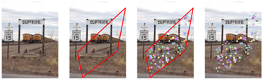

# False Labels Effect

Measuring the effect of false labels within training data on model performance.

Two different classification tasks (4 & 14 classes) are performed using computer vision deep learning models.
Modifications to the images and respective labels are generated artificially, resulting in 100% correct data labels.
As a baseline, the model is trained and tested on the 100% correctly labeled data.

Then, some labels are updated (falsified) iteratively per training run (e.g. 0.5%, 1%, 2%, etc.) to match a desired false label rate in the training data. 
The model is then trained on the modified data including falsified labels, and tested using correctly labeled data.
Resulting metrics are examined comparing the model performance on the modified data with each other and to the model performance on the 100% correctly labeled data using regression.

 

 

Examples of altered images, each left to right: original image, original image with drawn in region of change, original image with drawn-in region including changed pixel values - and changed image with which the neural networks were trained

 

Using the `data_generator` module, 4 classes and 14 subclasses are generated:
1. Blobs: Add blobs to image within the randomly generated polygonal shape
    1. uni-color Red
    2. uni-color Green
    3. uni-color Blue
    4. multi-color Blue / Green / Red
2. Blur: Blur image within the randomly generated polygonal shape
    1. Gaussian blur
3. Color-channel-change: Randomly changes the order of the color channels within the gernerated polygon
    1. Blue - Green - Red
    2. Blue - Red - Green
    3. Green - Blue - Red
    4. Green - Red - Blue
    5. Red - Blue - Green
4. Color distortion: Change the hue within the generated polygonal shape 
    1. Red
    2. Green
    3. Blue
    4. All

 

------------------------

 

## Project Structure

The projects is structured as follows:

- [./assets/](./assets/):
    - artificial image altering examples (png files)
    - evaluation visualizations will be created as generated by `./notebooks/` (png files)
- [./config/](./config/): log configurations
- [./data/](./data/):
    - artificially altered image data (based on pascal voc, png files) for training and evaluation as well as labels (npy files)
    - aggregated class reports as generated by `./src/evaluation/main.py` (csv file)
- [./logs/](./logs/): training and evaluation logs
    - subfolder `class_report` will be created during training, including a sklearn based class reports after each epoch per training run (json files) 
    - subfolder `label_mapping` will be created during training, including a mapping of the labels to their respective names for each training run (json files)
    - subfolder `model_summary` will be created during training, including a summary of the model architecture for each run (txt files)
    - subfolder `models` will be created during training, storing the trained model for each run (h5 files)
    - subfolder `scalars` will be created during training, including tensorboard scalar metrics logs for training, validation and test phase for each run (tensorboard event files)
    - subfolder `regr_results` will be created during classification result evaluation (e.g., accuracy over false labels ratio regression), including a csv file with the regression results (csv file)
- [./notebooks/](./notebooks/): Jupyter notebooks
    - [./notebooks/exploratory.ipynb](./notebooks/exploratory.ipynb): exploratory analysis of the classification labels
    - [./notebooks/result_regression.ipynb](./notebooks/result_regression.ipynb): view regression results of false labels ratio prediction based on classification results
    - [./notebooks/result_visualization.ipynb](./notebooks/result_visualization.ipynb): visualizing classification preformance results (e.g., accuracy, precision, recall, f1-score)
- [./src/](./src/): preprocessing, training and evaluation modules
    - [./src/data_generator/](./src/data_generator/): module to modify images and create labels (100% correctly labeled data)
    - [./src/evaluation/](./src/evaluation/): module to train and test regression on classification results
    - [./src/false_labels_effect/](./src/false_labels_effect/): module to train and test the classification models
- [./tests/](./tests/): testing module

 

The modules in `src` are setup as follows:

- [./src/false_labels_effect/](./src/false_labels_effect/): module to train and test the classification models
    - [./src/false_labels_effect/callbacks.py](./src/false_labels_effect/callbacks.py): tensorflow callbacks for the models
    - [./src/false_labels_effect/data_loader.py](./src/false_labels_effect/data_loader.py): keras data loader
    - [./src/false_labels_effect/gpu_config.py](./src/false_labels_effect/gpu_config.py): GPU configuration
    - [./src/false_labels_effect/main.py](./src/false_labels_effect/main.py): **entry point for classification training and testing**
    - [./src/false_labels_effect/models.py](./src/false_labels_effect/models.py): model architecutre definition and initialization
    - [./src/false_labels_effect/util.py](./src/false_labels_effect/util.py): utility functions for data and label processing
- [./src/data_generator/](./src/data_generator/): module to modify images and create labels (100% correctly labeled data)
    - [./src/data_generator/generate_data.py](./src/data_generator/generate_data.py): **entry point for generating artificially altering images and respective labels**
    - ~~[./src/data_generator/main.py](./src/data_generator/main.py):~~ not used
    - [./src/data_generator/util.py](./src/data_generator/util.py): utility functions for artificial image altering and label generation
- [./src/evaluation/](./src/evaluation/): module to train and test regression on classification results
    - [./src/evaluation/main.py](./src/evaluation/main.py): **entry point for regression training and testing**
    - [./src/evaluation/tensorboard_load.py](./src/evaluation/tensorboard_load.py): load metrics from a specified live tensorboard
    - [./src/evaluation/util.py](./src/evaluation/util.py): utility function for data and label processing as well as model training

 

------------------------

 

## Getting Started

To set up your local development environment, please use a fresh virtual environment.

To create the environment run:

    conda env create --file=environment-dev.yml

To activate the environment run:

    conda activate false-labels

To update this environment with your production dependencies run:

    conda env update --file=environment.yml

 

------------------------

 

### Testing

We use `pytest` as test framework. To execute the tests, please run

    python setup.py test

To run the tests with coverage information, please use

    python setup.py testcov

and have a look at the `htmlcov` folder, after the tests are done.

 

------------------------

 

### Notebooks

To use your module code (`src/`) in Jupyter notebooks (`notebooks/`) without running into import errors, make sure to install the source locally

    pip install -e .

This way, you'll always use the latest version of your module code in your notebooks via `import false_labels_effect`.

Assuming you already have Jupyter installed, you can make your virtual environment available as a separate kernel by running:

    conda install ipykernel
    python -m ipykernel install --user --name="false-labels-effect"

Note that we mainly use notebooks for experiments, visualizations and reports. Every piece of functionality that is meant to be reused should go into module code and be imported into notebooks.

 

------------------------

 

### Tensorboard

Tensorboard is partially used for logging training, validation and testing resutls. To view Tensorboard with logged metrics, open terminal, activate created env and from project root directory start Tensorboard via
    
    tensorboard --logdir ./logs/scalars

Then open http://localhost:6006/ in your prefered browser.

 

------------------------

 

### Contributions

Before contributing, please set up the pre-commit hooks to reduce errors and ensure consistency

    pip install -U pre-commit
    pre-commit install
 

------------------------

 

## Contact

Daniel Czwalinna (daniel.czwalinna@alexanderthamm.com)

## License

© Alexander Thamm GmbH
